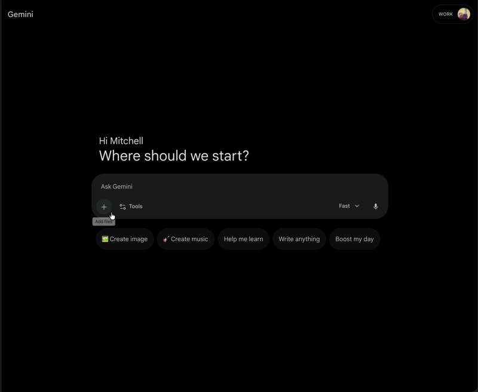

# clipdisk

[](https://sonarcloud.io/summary/new_code?id=mitchins_clipdisk)
[](https://codecov.io/gh/mitchins/clipdisk)

A macOS menu bar utility that writes clipboard contents (images, files) to a RAM disk at `/Volumes/Clipboard/`.

Solves one problem: websites with `<input type="file">` that don't accept paste. Copy an image, pick it from `/Volumes/Clipboard/` in the file dialog. That's it.



## Is this for you?

You've copied a screenshot or image, hit "Upload" on some website, and the file picker opens with no way to paste. You have to save the image somewhere first, find it, upload it, then delete it. This skips all of that.

Clipboard content lives on a RAM disk. Nothing touches your real disk. It vanishes when you quit or reboot.

## Install

Recommended (release DMG):

1. Download the latest `ClipboardFolder-<version>.dmg` from GitHub Releases
2. Open the DMG and drag `ClipboardFolder.app` into Applications
3. Launch `ClipboardFolder.app`

Build locally:

```sh
git clone git@github.com:mitchins/clipdisk.git
cd clipdisk
make app
open ClipboardFolder.app
```

Requires macOS 14+. No sudo, no kernel extensions, no admin privileges.

## Usage

1. Copy an image or file
2. A clipboard icon appears in the menu bar (filled = content available)
3. In any file picker, navigate to the "Clipboard" volume under Locations
4. Select the file

The menu bar dropdown shows what's on the volume and lets you open Finder, clear contents, or quit (which ejects the volume).

## Finder Appearance (Optional)

You can make `/Volumes/Clipboard` look more like a polished DMG window (custom icon layout, background artwork, and helper text embedded in an image).

Add a Finder template under `Resources/FinderTemplate`:

- `Resources/FinderTemplate/.DS_Store`
- `Resources/FinderTemplate/.background/instructions.png` (optional)

On mount/recovery, clipdisk copies these files onto the RAM disk before you browse it.

Template creation flow:

1. Manually create a reference volume named `Clipboard`
2. Arrange Finder icon view/background exactly how you want
3. Copy out the generated `.DS_Store` into `Resources/FinderTemplate`
4. Rebuild the app with `make app`

If no template files are present, behavior is unchanged.

## License

MIT
